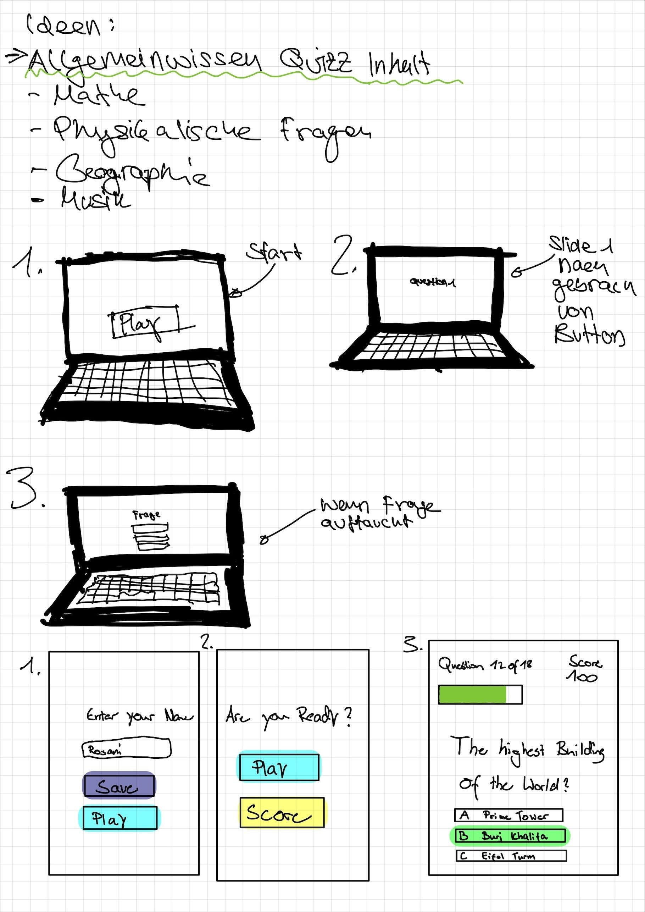

# Reflexion

## 1. Woche
In der 1 Woche haben mussten wir uns Gedanken für ein Projekt machen. Wir haben ein Brain storming gemacht uns wurden uns sehr schnell einig um was für ein Projekt es sich handeln sollte unzwar machen wir ein Quiz. Wir werden dies mit JavaScript,Html und Css Programmieren. Als wir eine Idee hatten bekannen wir mit der Planung. Die Planung haben wir mit einigen Skizzen dargestellt und haben auch ein Adobe XD Plan erstellt.

## 2. Woche
In der 2.Woche haben wir versucht unser Projekt mit Git zu verbinden. Leider waren wir da nicht sehr erfolgreich und hatten grosse Schwierigkeiten weil wir anscheinend keinen Zugang hätten. Doch nachdem wir uns es  zusammen anschauten haben wir es geschafft und konnten erfolgreich pull und push requests ausführen.

## 3. Woche
In der Dritten Woche haben wir mit dem Programmieren unseres Projektes gestartet. Da Git nach einer weile entflich Funktionierte konnten wir entlich Starten.  Wir haben es gut Aufteilen können wer was macht da wir eine gute Skizze haben. Dass heisst jemand machte die Index seite und das Css und die andere machte dann das gleiche einfach für die Spielseite. 
* Was in der 3 Woche gut lief war die kommunikation wer was macht und die Aufteilung
* Was weniger gut war ist das Git manchmal probleme mit dem Pushen hat.

## 4. Woche
In der vireten und letzen Woche mussten wir unser Projekt noch fertig macchen und die Präsentation erstellen.
Wir hatten eine kleine Design änderung und haben unser Projkt einwenig umdesignt weil das andere nicht so gut geklappt hat.
Also mussten wir das Css nochmals umändern. Mit dem Css sind wir recht schnell fertig geworden und haben an unserer Präsentation gearbeitet
